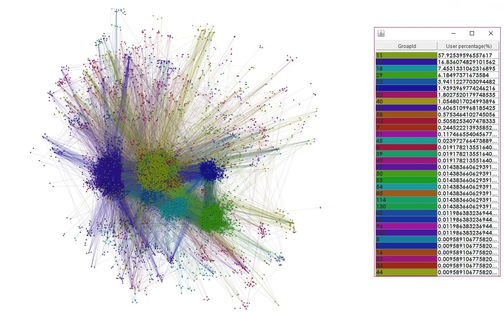
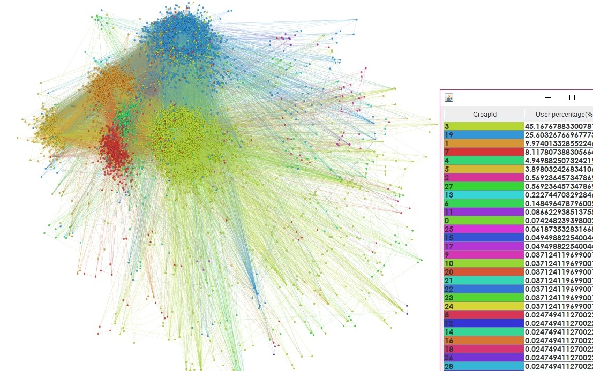
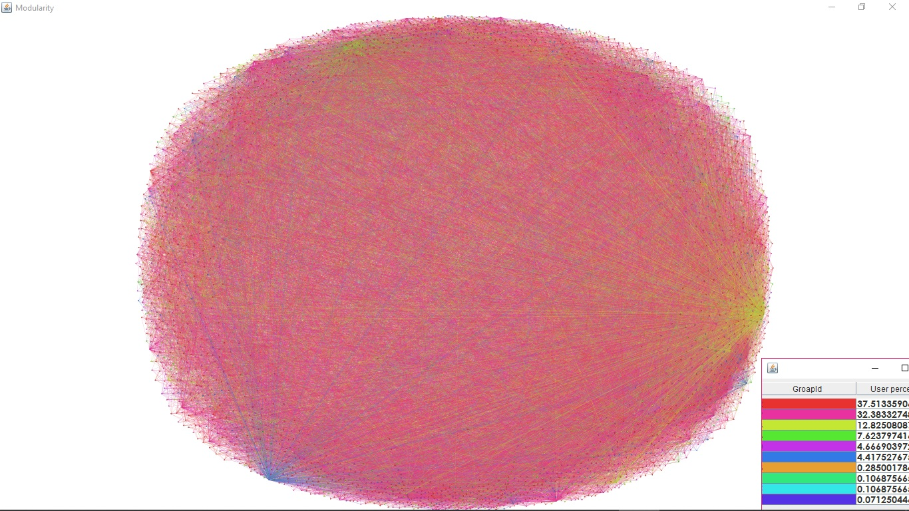
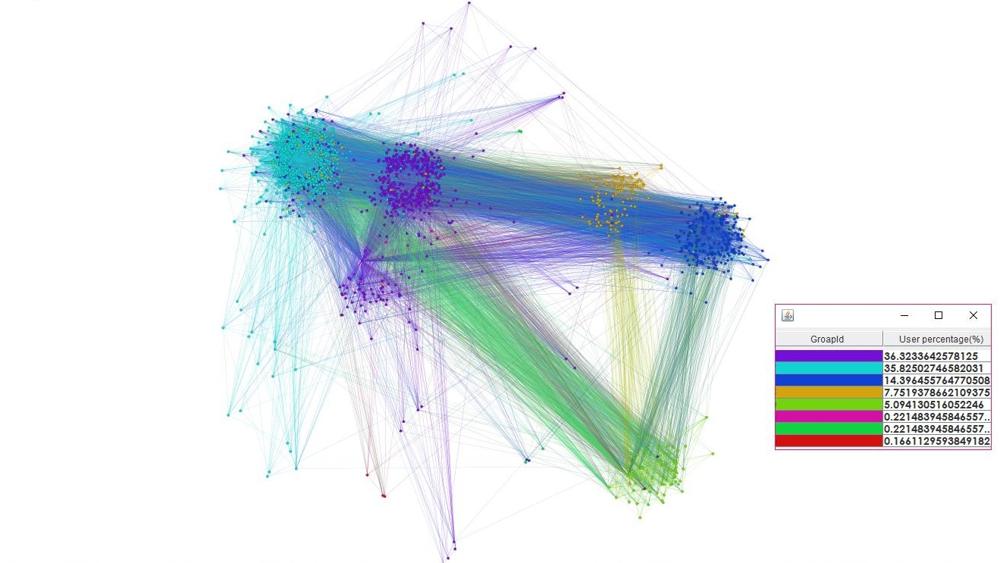
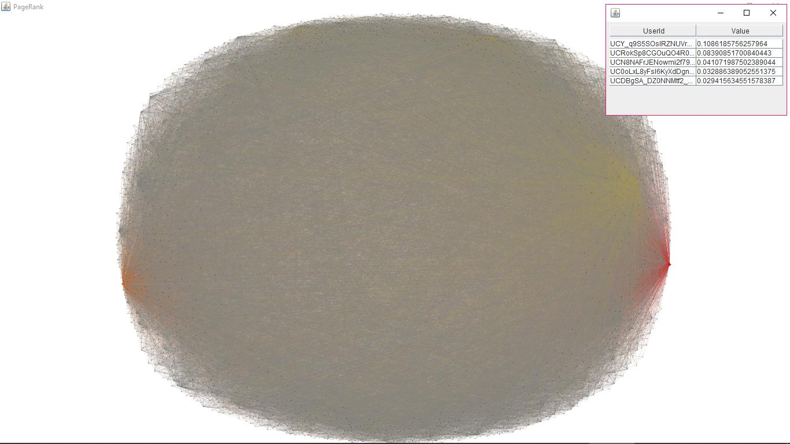
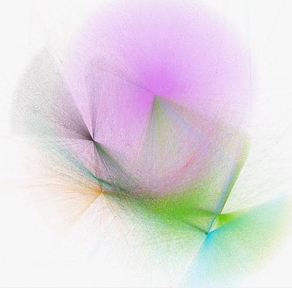
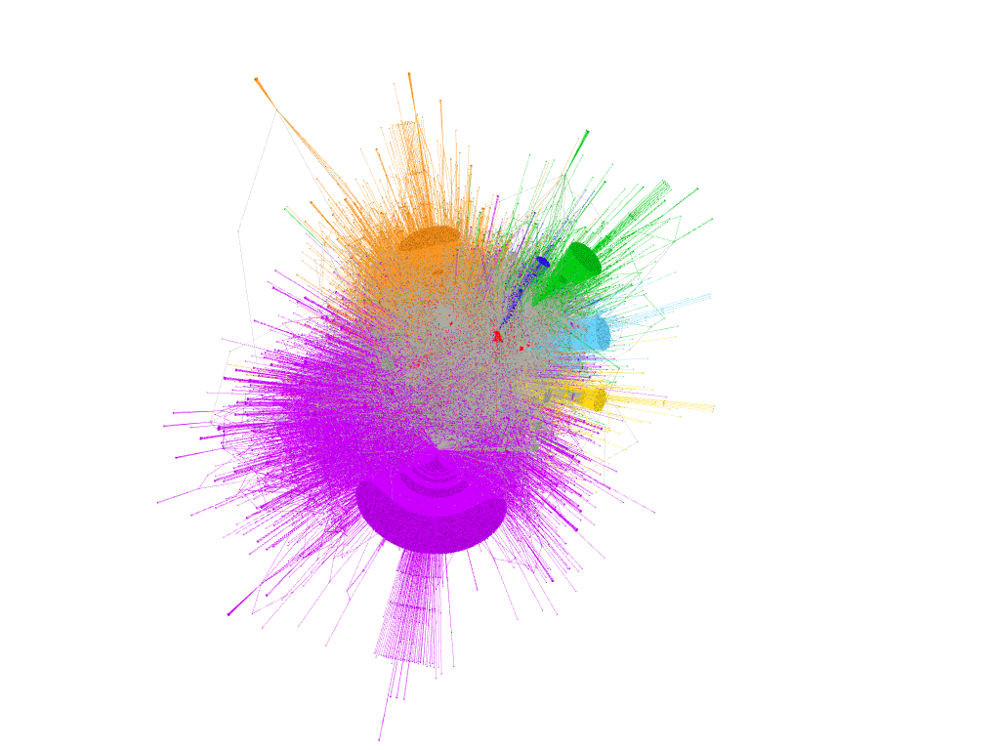
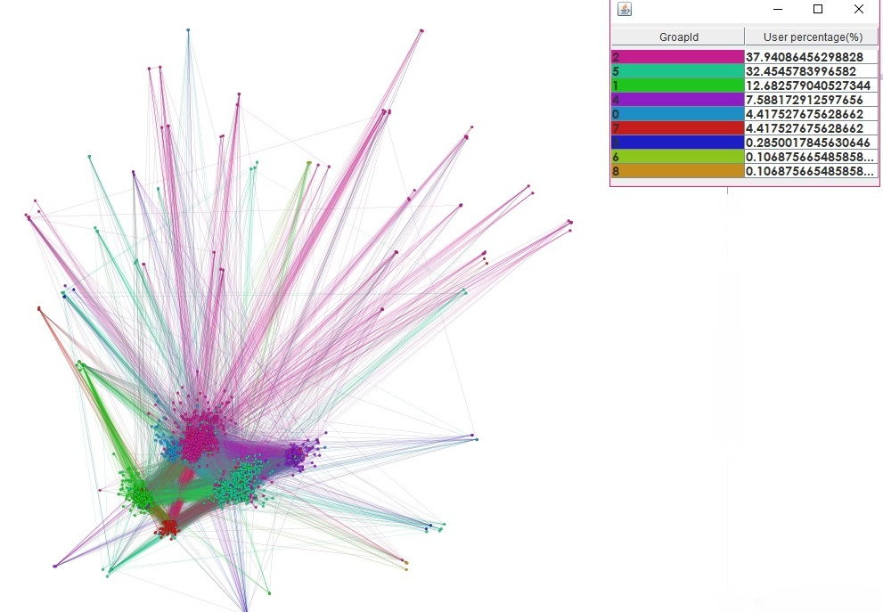
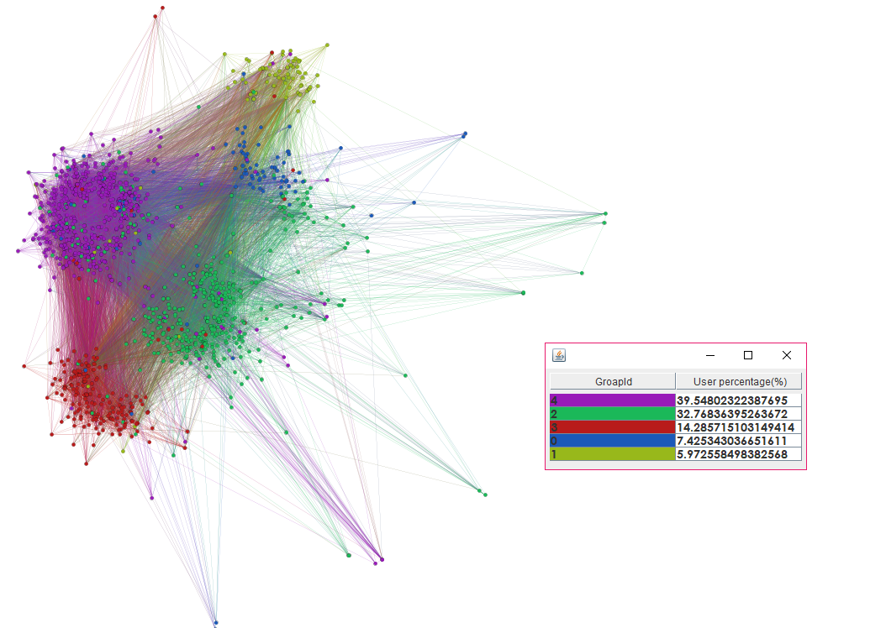
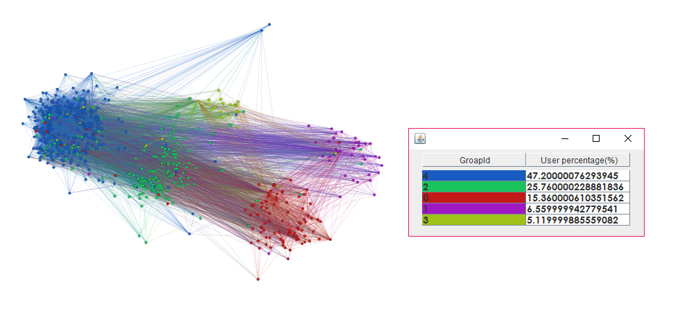

# Модуль по визуализации
## Сборка проекта
[](https://travis-ci.org/Snezzz/youtube_data_api)
[](https://ci.appveyor.com/api/projects/status/github/Snezzz/youtube_data_api)  

### Системные требования:
  * OS: Windows x86/x86_64, Linux x86/x86_64  
  * Оперативная память (RAM): 13n Free RAM, где n - минимальное количество видео в запросе  
  * Для сборки: версия Java не ниже 1.8
   
### Сборка из исходников:  
1.Установите Java  
2.Установите Apache Maven (http://maven.apache.org)  
3.В терминале: ```mvn compile```  
4.```mvn assembly:single```  


## Описание модуля
  Модуль отвечает за получение данных из БД и выбор варианта построения графа.
  
  ## Визуализация (k - мин. степень вершин)
  ##### OpenOrd, Modularity, k=1
  
  ##### OpenOrd, Modularity, k=3
   
  ##### Yifan Hu, Modularity, k=6
   
  ##### OpenOrd, Modularity, k=8
   
   ##### Yifan Hu, PageRank k=6
   
   ##### Modularity
   
   ##### ForceAtlas2, special graph
   
  ##### OpenOrd, Modularity, k=6
   
   ##### OpenOrd, Modularity, k=10
   
   ##### OpenOrd, Modularity, k=12
   
